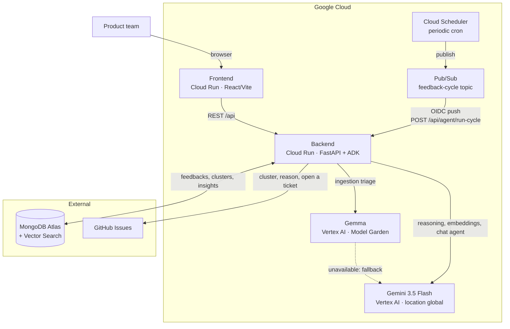

# feedbackai-agent

An agent that reads raw product feedback for an early-stage SaaS product: it ingests, triages,
and clusters the feedback, then acts on it by opening a ticket in an external tracker (GitHub
Issues) for each problem that matters. Built for the *All Things Agentic* hackathon
(Devpost / Google Cloud).

**The demo projects and feedbacks (`project_id="demo"`, inserted by `setup_mongodb.py`) are
fictional**, made up to illustrate the pipeline. No real user data.

**Disclosure:** This project was built during the Submission Period in a new repository. It
reuses a small amount of pre-existing code from my earlier prototype (feedback ingestion,
clustering, and insight helpers), adapted here. Everything else, including the ADK
orchestration, the action loop, background execution, the Gemma triage stage, and the frontend,
was built during the Submission Period.

## Features

- **Multi-source ingestion**: free text, CSV upload, or a URL (App Store reviews via Apple's
  RSS feed, or the extracted text of any other page).
- **PII scrubbing**: emails and phone numbers are masked before any model call or storage, not
  just before display.
- **Bilingual, FR/EN, end to end**, not a UI translation layer bolted on top:
  - Each feedback's language is detected deterministically (a language-ID library, not a model
    guess), independent of anything else.
  - Feedback in French and English about the same problem lands in the same cluster: grouping
    is by embedding similarity, not keyword matching, so duplicate signal in two languages
    becomes one.
  - Team-facing output (cluster labels, insights recommendations, ticket titles and bodies,
    notifications) is written in the team's configured language (`team_language`, FR or EN),
    while direct quotes from the original feedback keep their source language, untranslated.
  - The chat agent answers in whichever language you write to it in, regardless of
    `team_language`.
  - The frontend's own FR/EN toggle is tied to `team_language`: switching it changes the
    language of both the interface and future AI-generated content, not just the UI chrome.
- **Insights dashboard**: total and weekly feedback counts, average sentiment, top issues by
  category, and three Gemini-generated actionable recommendations, refreshed on demand.
- **Conversational agent**: ask questions about the feedback in natural language; the chat
  agent uses the same tools (semantic search, insights, clustering) as the autonomous cycle,
  including Atlas Vector Search for meaning-based lookup, not exact text match.
- **Autonomous action**: for clusters that clear both a volume and a severity threshold, the
  agent opens a real GitHub issue on its own and notifies the team, no human in the loop.
  Idempotent and safe under concurrent or duplicate triggers (Pub/Sub redelivery, manual
  re-runs): a cluster is only ever ticketed once, verified under a genuine race condition, not
  just in theory.
- **Scheduled autonomy**: the full cycle (cluster → insights → ticket → notify) also runs on
  its own on a recurring schedule via Cloud Scheduler and Pub/Sub, not only on demand.

## Prerequisites

| Tool | Version | Used for |
|---|---|---|
| Python | 3.11+ | Backend (`agent/`) |
| Node.js | 20+ | Frontend (`frontend/`) |
| gcloud CLI | recent, authenticated (`gcloud auth login`) | Cloud Run / Vertex AI deployment |
| MongoDB Atlas account | active cluster | Database + Vector Search |
| GitHub token | `issues` scope only | The agent's external action (`create_ticket`) |
| Gemini API key | [aistudio.google.com](https://aistudio.google.com) | Reasoning, embeddings, triage fallback |

## Tech stack

| Layer | Technology |
|---|---|
| Agent | Google ADK (`LlmAgent` + `Runner`) |
| Reasoning, chat, summaries | `gemini-3.5-flash` (Vertex AI, `global` location only: 404 on `us-central1`) |
| Embeddings | `gemini-embedding-001`, 768 dims (Vertex AI) |
| Per-item triage (ingestion) | Gemma (Vertex AI, Model Garden), Gemini fallback |
| Backend | FastAPI |
| Data | MongoDB Atlas + Atlas Vector Search |
| Frontend | React / Vite |
| Deployment | Cloud Run (backend + frontend) |

## Architecture



Autonomous loop: `Cloud Scheduler` triggers a cycle periodically through `Pub/Sub`, which pushes
to `POST /api/agent/run-cycle` on the backend. The agent (ADK) picks up unclustered feedback,
groups it, generates insights, and **opens a real GitHub ticket** for each cluster that clears
the threshold. No human in the loop.

## Architecture: two models

- **Gemma** (Vertex AI, Model Garden): per-item triage at ingestion, language, category,
  sentiment, summary, in one call. A small dedicated model for high-volume, low-cost work.
- **Gemini 3.5 Flash** (Vertex AI): low-volume reasoning, cluster labels, recommendations, the
  chat agent, and an **automatic fallback** for triage if the Gemma endpoint isn't deployed or
  doesn't respond. Both models now run on Vertex AI, billed against Google Cloud credits
  instead of the Gemini API's separate free tier (5 requests/minute, 20/day, too restrictive
  under real use). `gemini-3.5-flash` is only available in the `global` location for this
  project (still 404 on `us-central1`).

```
text/CSV/URL feedback
       │
       ▼
  PII scrub (regex: emails, phone numbers)
       │
       ▼
  triage: Gemma ──(unavailable)──▶ Gemini 3.5 Flash (fallback)
       │
       ▼
  embedding (Gemini) → MongoDB Atlas (+ Vector Search)
       │
       ▼
  clustering, insights, chat agent (ADK) → Gemini 3.5 Flash
```

**Feedback sources:** free text, CSV upload, or a URL.

CSV upload (`POST /api/ingest/csv`) reads one feedback per row, from a `text`, `feedback`, or
`content` column (checked in that order, first one present wins). Every other column is
ignored. Each row goes through the same pipeline as a single text submission: clean, scrub PII,
triage, embed, store, in the background, one at a time.

A URL is handled one of two ways (`agent/tools/fetch_url.py`):
- An App Store app page: pulls the most recent reviews through Apple's public RSS feed (no
  scraping), one feedback per review.
- Any other page: fetches it and extracts the main text, treated as a single feedback.

G2, Trustpilot, and Play Store aren't supported: their reviews load through client-side
JavaScript, invisible to a plain HTTP fetch. Scraping them properly would need a headless
browser, out of scope for now.

## How it works: from feedback to ticket

The pipeline has two separate phases with different triggers, and each decision point has its
own rule. Worth spelling out precisely, since "a cluster forms" and "a ticket gets filed" are
governed by different, unrelated conditions.

**1. Ingestion (real-time, one feedback at a time).** Every incoming feedback is cleaned,
scrubbed of emails/phone numbers, triaged (language, category, sentiment, one-line summary),
embedded, and stored. This runs immediately on submission. Nothing downstream happens yet: a
freshly ingested feedback sits alone until the next cycle.

**2. Clustering (batch, part of the autonomous cycle).** `cluster_feedback()`
(`agent/tools/cluster_feedback.py`) groups feedbacks by semantic similarity of their
embeddings: cosine similarity ≥ `SIMILARITY_THRESHOLD` (0.82), at least `MIN_CLUSTER_SIZE` (2)
members. **Sentiment plays no role here**: a cluster of universally positive feedback forms
exactly the same way as a cluster of complaints, as long as the embeddings are close enough. A
lone feedback with no semantic match to anything else never becomes a cluster; it stays visible
in the raw feedback list, not in the Clusters tab.

**3. Ticket creation (batch, same cycle, per cluster).** `create_ticket()`
(`agent/tools/create_ticket.py`) only fires for a cluster that clears **both**
`TICKET_MIN_FEEDBACK_COUNT` (3 feedbacks) **and** `TICKET_SENTIMENT_THRESHOLD` (average
sentiment ≤ -0.3). This is where sentiment actually gates action: the intent is to only file
tickets for corroborated, clearly negative problems, not one-off complaints or positive
clusters. A cluster below either threshold is simply skipped, silently, every cycle, until it
either grows or its sentiment worsens.

**4. Notification.** Fires automatically whenever step 3 creates a ticket. Not triggered
independently today.

Both thresholds in steps 2 and 3 are plain constants (`agent/tools/cluster_feedback.py`,
`agent/config.py`), not configurable per project. Tuned once for this hackathon's demo data,
not validated against real production feedback volume. A fuller version would make them
per-project settings (a noisy, high-volume product likely needs a stricter threshold than a
low-volume one), and would very likely replace the single hardcoded 0.82 cosine cutoff with
something less brittle, an actual clustering algorithm instead of the current single-pass
greedy nearest-centroid (see the comment in `cluster_feedback.py`), since greedy assignment is
sensitive to the order feedbacks happen to be processed in and can under- or over-split
borderline cases.

## MongoDB setup

1. **Create a MongoDB Atlas cluster** (the free tier is enough for the demo) and grab the
   connection URI.

2. **Create the collections, indexes, and demo data:**
   ```bash
   cd agent
   python3 setup_mongodb.py
   ```
   This script creates the collections (`projects`, `feedbacks`, `clusters`, `insights`, plus a
   legacy `users` collection kept for schema compatibility but unused, this project has no
   authentication) with their JSON Schema validators, all application indexes, and inserts one
   project plus 8 **fictional** feedbacks (`project_id="demo"`) for the demo.

3. **Create the Atlas Vector Search index. Manual step, no way around it:** PyMongo can't
   create it (the script above prints the same instructions at the end of its run):
   - Atlas UI → your cluster → **Atlas Search** tab → **Create Search Index**
   - Pick **Vector Search** (JSON editor), Database `feedbackai`, Collection `feedbacks`
   - Paste:
     ```json
     {
       "name": "feedback_vector_index",
       "type": "vectorSearch",
       "definition": {
         "fields": [
           { "type": "vector", "path": "embedding", "numDimensions": 768, "similarity": "cosine" },
           { "type": "filter", "path": "project_id" },
           { "type": "filter", "path": "category" },
           { "type": "filter", "path": "sentiment" }
         ]
       }
     }
     ```

## Deploying to Cloud Run

Backend and frontend are two separate Cloud Run services, built through Cloud Build
(`infra/cloudbuild.backend.yaml` / `infra/cloudbuild.frontend.yaml`). The frontend needs the
backend URL **at build time** (Vite bakes it in during compilation), so deploy the backend
first.

1. **Variables** (adjust to your project):
   ```bash
   PROJECT_ID=feedbackai-497622
   ```

2. **Secrets in Secret Manager** (never in the repo):
   ```bash
   echo -n "<value>" | gcloud secrets create gemini-api-key    --data-file=- --project=$PROJECT_ID
   echo -n "<value>" | gcloud secrets create mongodb-uri       --data-file=- --project=$PROJECT_ID
   echo -n "<value>" | gcloud secrets create github-token      --data-file=- --project=$PROJECT_ID
   echo -n "<value>" | gcloud secrets create github-repo-map   --data-file=- --project=$PROJECT_ID
   echo -n "<value>" | gcloud secrets create run-cycle-secret  --data-file=- --project=$PROJECT_ID
   ```

3. **Deploy the backend.** `--set-env-vars` in `infra/cloudbuild.backend.yaml` **replaces the
   entire environment, not just the keys you pass**: redeploying without explicit
   substitutions silently resets `FRONTEND_ORIGINS` to `http://localhost:5173`,
   `GEMMA_ENDPOINT_ID` to empty (Gemma goes silently disabled, straight to the Gemini
   fallback), and **`PUBSUB_PUSH_SERVICE_ACCOUNT`/`RUN_CYCLE_AUDIENCE` to empty (the real
   Cloud Scheduler → Pub/Sub autonomous cycle starts failing every push with 401, silently;
   direct calls with `RUN_CYCLE_SECRET` still work, which masks it)**. This bit us in practice
   on routine redeploys, twice. **Always pass all five substitutions, every time, including
   the very first deploy:**
   ```bash
   FRONTEND_URL=$(gcloud run services describe feedback-agent-frontend \
     --region=us-central1 --format='value(status.url)' --project=$PROJECT_ID 2>/dev/null)
   FRONTEND_URL=${FRONTEND_URL:-http://localhost:5173}   # not deployed yet on a first-ever run

   BACKEND_URL=$(gcloud run services describe feedback-agent \
     --region=us-central1 --format='value(status.url)' --project=$PROJECT_ID 2>/dev/null)

   gcloud builds submit --config=infra/cloudbuild.backend.yaml \
     --substitutions=_FRONTEND_ORIGIN=$FRONTEND_URL,_GEMMA_ENDPOINT_ID=<your Gemma endpoint id>,_GEMMA_LOCATION=<your Gemma region>,_PUBSUB_PUSH_SERVICE_ACCOUNT=pubsub-run-cycle-invoker@$PROJECT_ID.iam.gserviceaccount.com,_RUN_CYCLE_AUDIENCE=${BACKEND_URL}/api/agent/run-cycle \
     --project=$PROJECT_ID .
   ```
   Leave `_GEMMA_ENDPOINT_ID` empty (`_GEMMA_ENDPOINT_ID=`) if Gemma isn't deployed yet: the app
   falls back to Gemini, on purpose (see "Two models" above). Leave
   `_PUBSUB_PUSH_SERVICE_ACCOUNT`/`_RUN_CYCLE_AUDIENCE` empty on a first-ever deploy, before the
   Pub/Sub setup in "Scheduled trigger" below exists.

   If the service still rejects unauthenticated calls despite `--allow-unauthenticated` (the
   Cloud Build service account may lack permission to apply the IAM policy on its own, this
   happened in practice), open it explicitly:
   ```bash
   gcloud run services add-iam-policy-binding feedback-agent \
     --region=us-central1 --member=allUsers --role=roles/run.invoker --project=$PROJECT_ID
   ```

4. **Grab the backend URL:**
   ```bash
   BACKEND_URL=$(gcloud run services describe feedback-agent \
     --region=us-central1 --format='value(status.url)' --project=$PROJECT_ID)
   ```

5. **Deploy the frontend**, passing the backend URL as a build argument:
   ```bash
   gcloud builds submit --config=infra/cloudbuild.frontend.yaml \
     --substitutions=_BACKEND_URL=$BACKEND_URL --project=$PROJECT_ID .
   ```
   Same IAM check as the backend, if needed:
   ```bash
   gcloud run services add-iam-policy-binding feedback-agent-frontend \
     --region=us-central1 --member=allUsers --role=roles/run.invoker --project=$PROJECT_ID
   ```

6. **First deploy only:** the backend was deployed in step 3 before the frontend existed, so it
   fell back to `http://localhost:5173`. Now that the frontend is up, point it at the real URL
   (safe: `--update-env-vars` merges instead of replacing, unlike `--set-env-vars`):
   ```bash
   FRONTEND_URL=$(gcloud run services describe feedback-agent-frontend \
     --region=us-central1 --format='value(status.url)' --project=$PROJECT_ID)

   gcloud run services update feedback-agent --region=us-central1 \
     --update-env-vars=FRONTEND_ORIGINS=$FRONTEND_URL --project=$PROJECT_ID
   ```
   On every later backend redeploy, step 3 already re-fetches this URL on its own, no manual
   fix-up needed, as long as the substitutions are passed as shown there. This same
   `--update-env-vars` command is also the fastest way to patch `FRONTEND_ORIGINS` or
   `GEMMA_ENDPOINT_ID` alone, without a full rebuild.

**Check:** `curl $BACKEND_URL/health` responds, and the deployed frontend loads real data from
that backend (no calls to `localhost`).

## Deploying the Gemma endpoint (manual)

No automated script for this one: Vertex AI Model Garden deployment is a console-driven flow.
Here's the exact sequence:

1. **Pick the model in Model Garden**
   GCP Console → Vertex AI → Model Garden → search "Gemma". Pick an instruction-tuned variant:
   `gemma-3-1b-it` (lowest cost) or `gemma-3-4b-it` (sturdier on FR/EN), depending on the
   triage quality you observe.

2. **Deploy to a dedicated endpoint**
   From the model page: "Deploy" → vLLM container (image provided by Model Garden). Machine
   `g2-standard-12` + 1 `NVIDIA_L4` GPU. Give the endpoint a clear name (e.g.
   `feedbackai-gemma-triage`).

3. **Grab the ENDPOINT_ID**
   ```bash
   gcloud ai endpoints list --region=<GEMMA_LOCATION> --format="table(name,displayName)"
   ```
   `ENDPOINT_ID` is the last segment of `name` (`projects/.../endpoints/<ID>`).

4. **Set the environment variables** (`.env`, never committed):
   ```
   GCP_PROJECT_ID=<your project>
   GEMMA_ENDPOINT_ID=<the ID above>
   GEMMA_LOCATION=<deployment region>
   ```

5. **Measured request/response format** ("vLLM 32K context" deployment, `gemma-3-1b-it` /
   `NVIDIA_L4`, dedicated endpoint). Already handled by `agent/gemma_client.py`, but worth
   re-checking if the deployment changes container or config:
   - **Dedicated** endpoints (`dedicatedEndpointEnabled`, on by default for one-click Model
     Garden deployments) need a direct HTTP call to their own
     `*.prediction.vertexai.goog` domain, not the Vertex SDK (gRPC isn't supported on that
     domain, and the SDK's REST transport adds query parameters the gateway rejects).
   - The instance is sent in `"@requestFormat": "chatCompletions"` form
     (`messages: [{role, content}]`), required by this type of vLLM container.
   - The response's `predictions` field is **not** a list; it's the `chat.completion` object
     directly (`predictions.choices[0].message.content`).
   - `gemma-3-1b-it` sometimes wraps its JSON in ```` ```json ... ``` ```` fences despite the
     prompt asking it not to. Stripped in `ingest_feedback.py` before parsing.

6. **Undeploy after the demo** (billed by uptime, not by request):
   ```bash
   gcloud ai endpoints undeploy-model <ENDPOINT_ID> \
     --deployed-model-id=<DEPLOYED_MODEL_ID> --region=<GEMMA_LOCATION>
   ```
   The Gemini fallback means cutting the endpoint doesn't break anything: the app keeps working
   without it.

## Scheduled trigger (Cloud Scheduler + Pub/Sub)

**Prerequisite: the backend must already be running on Cloud Run** (deployment step above), the
push subscription needs a real URL. If that's not done yet, come back to this section later.

Setup: `Cloud Scheduler` publishes to a `Pub/Sub` topic, which pushes (with an OIDC token) to
`POST /api/agent/run-cycle` on Cloud Run. The endpoint verifies that token itself (see
`agent/main.py`), never a public unauthenticated service.

1. **Variables** (adjust to your project):
   ```bash
   PROJECT_ID=feedbackai-497622
   REGION=us-central1
   SERVICE_NAME=feedback-agent
   ```

2. **A dedicated service account for Pub/Sub:**
   ```bash
   gcloud iam service-accounts create pubsub-run-cycle-invoker \
     --display-name="Pub/Sub push invoker for run-cycle" \
     --project=$PROJECT_ID
   ```

3. **Let that account call the Cloud Run service:**
   ```bash
   gcloud run services add-iam-policy-binding $SERVICE_NAME \
     --region=$REGION \
     --member="serviceAccount:pubsub-run-cycle-invoker@${PROJECT_ID}.iam.gserviceaccount.com" \
     --role="roles/run.invoker"
   ```

4. **Let the Pub/Sub service agent mint tokens on that account's behalf:**
   ```bash
   PROJECT_NUMBER=$(gcloud projects describe $PROJECT_ID --format='value(projectNumber)')
   gcloud iam service-accounts add-iam-policy-binding \
     pubsub-run-cycle-invoker@${PROJECT_ID}.iam.gserviceaccount.com \
     --member="serviceAccount:service-${PROJECT_NUMBER}@gcp-sa-pubsub.iam.gserviceaccount.com" \
     --role="roles/iam.serviceAccountTokenCreator"
   ```

5. **Create the topic:**
   ```bash
   gcloud pubsub topics create feedback-cycle --project=$PROJECT_ID
   ```

6. **Create the push subscription, with the OIDC audience:**
   ```bash
   SERVICE_URL=$(gcloud run services describe $SERVICE_NAME --region=$REGION --format='value(status.url)')

   gcloud pubsub subscriptions create feedback-cycle-push \
     --topic=feedback-cycle \
     --push-endpoint="${SERVICE_URL}/api/agent/run-cycle" \
     --push-auth-service-account="pubsub-run-cycle-invoker@${PROJECT_ID}.iam.gserviceaccount.com" \
     --push-auth-token-audience="${SERVICE_URL}/api/agent/run-cycle" \
     --project=$PROJECT_ID
   ```

7. **Set the Cloud Run service's remaining environment variables:**
   ```
   PUBSUB_PUSH_SERVICE_ACCOUNT=pubsub-run-cycle-invoker@<PROJECT_ID>.iam.gserviceaccount.com
   RUN_CYCLE_AUDIENCE=<SERVICE_URL>/api/agent/run-cycle
   ```

8. **Create the Cloud Scheduler job** (every 6h, for example):
   ```bash
   gcloud scheduler jobs create pubsub feedback-cycle-scheduler \
     --schedule="0 */6 * * *" \
     --topic=feedback-cycle \
     --message-body='{"project_id":"demo"}' \
     --location=$REGION \
     --time-zone="Europe/Paris" \
     --project=$PROJECT_ID
   ```
   `message-body` becomes the Pub/Sub message payload (base64-encoded automatically), which is
   exactly what `agent/main.py` expects to decode to find `project_id`.

**Required IAM roles (summary)**

| Identity | Role | On | Why |
|---|---|---|---|
| SA `pubsub-run-cycle-invoker` | `roles/run.invoker` | The Cloud Run service | Lets Pub/Sub (through this SA) call the endpoint |
| Pub/Sub service agent (`service-<PROJECT_NUMBER>@gcp-sa-pubsub.iam.gserviceaccount.com`) | `roles/iam.serviceAccountTokenCreator` | The SA `pubsub-run-cycle-invoker` | Lets Pub/Sub mint OIDC tokens on that SA's behalf |
| Cloud Scheduler service agent | `roles/pubsub.publisher` | The `feedback-cycle` topic | Usually granted automatically by `gcloud scheduler jobs create pubsub`, worth double-checking (`gcloud pubsub topics get-iam-policy feedback-cycle`) |

**Check:** wait for the next scheduled run (or force one with
`gcloud scheduler jobs run feedback-cycle-scheduler --location=$REGION`), then confirm in the
Cloud Run logs (`gcloud run services logs read $SERVICE_NAME --region=$REGION`) that a cycle
ran. Keep a screenshot for the GCP proof and the video.

## Running locally

```bash
cd agent
uvicorn main:app --host 0.0.0.0 --port 8000 --loop asyncio
```

**`--loop asyncio` is required, not optional.** `uvloop` (uvicorn's default loop) silently
breaks outgoing `httpx` calls to the GitHub API (`ConnectTimeout`), used by `create_ticket`.
Measured and reproduced outside the server: without this flag, `POST /api/agent/run-cycle`
fails with a 500 as soon as a ticket needs to be created.

## Environment variables

See `.env.example` for the full list. Summary:

| Variable | Used for | Required? |
|---|---|---|
| `GOOGLE_GENAI_USE_VERTEXAI` / `GOOGLE_CLOUD_PROJECT` / `GOOGLE_CLOUD_LOCATION` | Routes every Gemini call (chat, reasoning, embeddings, triage fallback) through Vertex AI | Yes. `GOOGLE_CLOUD_LOCATION` must be `global`: `gemini-3.5-flash` 404s on `us-central1` for this project |
| `GEMINI_API_KEY` | Unused by any Gemini call today (all clients auto-detect Vertex from the three variables above) | No, kept as a fallback credential only |
| `MONGODB_URI` / `MONGODB_DB` | Database | Yes |
| `GCP_PROJECT_ID` | Resolving the Gemma endpoint | No, falls back to Gemini without it |
| `GEMMA_ENDPOINT_ID` / `GEMMA_LOCATION` | Deployed Gemma endpoint | No, same fallback |
| `GITHUB_TOKEN` / `GITHUB_REPO_MAP` | Creating GitHub tickets | Yes, for `create_ticket` |
| `RUN_CYCLE_SECRET` | Direct auth for `run-cycle` (testing/debugging) | No |
| `PUBSUB_PUSH_SERVICE_ACCOUNT` / `RUN_CYCLE_AUDIENCE` | OIDC auth for `run-cycle` from Pub/Sub | No, without them only `RUN_CYCLE_SECRET` works |

## Scope and future work

`project_id` genuinely scopes the data: every write is tagged with it, and every backend read
filters by it, including the Atlas Vector Search tool used by the chat agent (verified end to
end, not just at the schema level). What's not built: no authentication, no user accounts, and
no runtime tenant switcher: each frontend deployment serves a single `project_id`, fixed at
build time via `VITE_PROJECT_ID`. The scheduled autonomous cycle currently runs for one project
(one Cloud Scheduler job); the code itself accepts a `project_id` per run and would support one
job per project without changes.