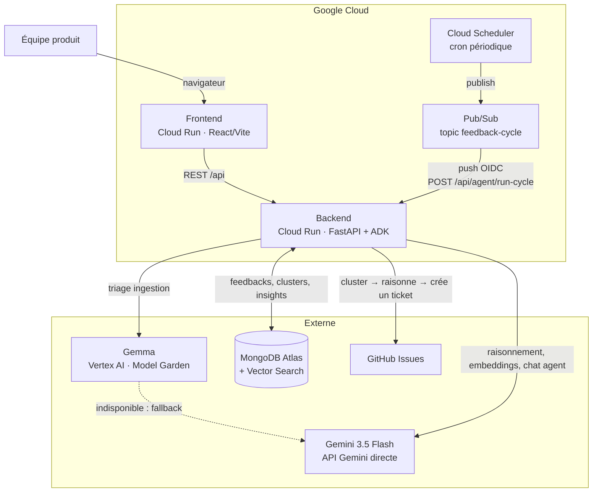

# feedbackai-agent

Agent d'analyse de feedback produit pour équipes SaaS early-stage — ingestion, triage,
clustering, insights, et action sur un tracker externe. Construit pour le hackathon
*All Things Agentic* (Devpost / Google Cloud).

**Les projets et feedbacks de démonstration (`project_id="demo"`, données insérées par
`setup_mongodb.py`) sont fictifs**, générés pour illustrer le pipeline — aucune donnée
utilisateur réelle.

**Origine du code :** ce projet part d'un prototype personnel préexistant (FeedbackAI, hors
hackathon) pour la forme générale du pipeline d'ingestion/clustering/insights et le squelette
FastAPI/React. Construits pendant le hackathon : l'orchestration Google ADK (remplace une boucle
maison), le triage hybride Gemma/Gemini avec détection de langue déterministe, le tool
`create_ticket` (action externe réelle, inexistante avant), le cycle autonome Cloud
Scheduler/Pub/Sub, les sorties bilingues, la conteneurisation et le déploiement Cloud Run des
deux services, et la refonte complète du frontend.

## Prérequis

| Outil | Version | Usage |
|---|---|---|
| Python | 3.11+ | Backend (`agent/`) |
| Node.js | 20+ | Frontend (`frontend/`) |
| gcloud CLI | récent, authentifié (`gcloud auth login`) | Déploiement Cloud Run / Vertex AI |
| Compte MongoDB Atlas | cluster actif | Base de données + Vector Search |
| Token GitHub | portée `issues` minimale | Action externe de l'agent (`create_ticket`) |
| Clé API Gemini | [aistudio.google.com](https://aistudio.google.com) | Raisonnement, embeddings, fallback triage |

## Stack technique

| Couche | Technologie |
|---|---|
| Agent | Google ADK (`LlmAgent` + `Runner`) |
| Raisonnement, chat, résumés | `gemini-3.5-flash` (API Gemini directe, pas Vertex — indisponible sur Vertex pour ce projet) |
| Vectorisation (embeddings) | `gemini-embedding-001`, 768 dims (API Gemini directe) |
| Triage par item (ingestion) | Gemma (Vertex AI, Model Garden), fallback Gemini |
| Backend | FastAPI |
| Données | MongoDB Atlas + Atlas Vector Search |
| Frontend | React / Vite |
| Déploiement | Cloud Run (backend + frontend) |

## Architecture



Boucle autonome : `Cloud Scheduler` déclenche périodiquement un cycle via `Pub/Sub`, qui pousse
vers `POST /api/agent/run-cycle` sur le backend. L'agent (ADK) reprend les feedbacks non
clusterisés, les regroupe, génère des insights, et **crée un vrai ticket GitHub** pour chaque
cluster prioritaire — sans intervention humaine.

## Architecture — deux modèles

- **Gemma** (Vertex AI, Model Garden) : triage par item à l'ingestion — langue, catégorie,
  sentiment, résumé, en un seul appel. Petit modèle dédié pour un travail à haut volume, coût
  maîtrisé.
- **Gemini 3.5 Flash** (API Gemini directe) : raisonnement à faible volume — labellisation de
  cluster, recommandations, chat agent — et **fallback automatique** du triage si l'endpoint
  Gemma n'est pas déployé ou ne répond pas.

```
feedback texte/CSV/URL
       │
       ▼
  scrub PII (regex : emails, téléphones)
       │
       ▼
  triage : Gemma ──(indisponible)──▶ Gemini 3.5 Flash (fallback)
       │
       ▼
  embedding (Gemini) → MongoDB Atlas (+ Vector Search)
       │
       ▼
  clustering, insights, chat agent (ADK) → Gemini 3.5 Flash
```

## Configuration MongoDB

1. **Créer un cluster MongoDB Atlas** (le tier gratuit suffit pour la démo) et récupérer l'URI
   de connexion.

2. **Créer les collections, index et données de démo** :
   ```bash
   cd agent
   python3 setup_mongodb.py
   ```
   Ce script crée les 5 collections (`users`, `projects`, `feedbacks`, `clusters`, `insights`)
   avec leurs validators JSON Schema, tous les index applicatifs, et insère un projet + 8
   feedbacks **fictifs** (`project_id="demo"`) pour la démonstration.

3. **Créer l'index Atlas Vector Search — action manuelle obligatoire**, PyMongo ne peut pas le
   créer (l'étape précédente affiche ces mêmes instructions à la fin de son exécution) :
   - Atlas UI → ton cluster → onglet **Atlas Search** → **Create Search Index**
   - Choisir **Vector Search** (JSON editor), Database `feedbackai`, Collection `feedbacks`
   - Coller :
     ```json
     {
       "name": "feedback_vector_index",
       "type": "vectorSearch",
       "definition": {
         "fields": [
           { "type": "vector", "path": "embedding", "numDimensions": 768, "similarity": "cosine" },
           { "type": "filter", "path": "project_id" },
           { "type": "filter", "path": "category" },
           { "type": "filter", "path": "sentiment" }
         ]
       }
     }
     ```

## Déploiement sur Cloud Run

Backend et frontend sont deux services Cloud Run distincts, construits via Cloud Build
(`infra/cloudbuild.backend.yaml` / `infra/cloudbuild.frontend.yaml`). Le frontend a besoin de
l'URL du backend **au moment du build** (Vite l'injecte à la compilation) : déployer le backend
en premier.

1. **Variables** (à adapter) :
   ```bash
   PROJECT_ID=feedbackai-497622
   ```

2. **Secrets dans Secret Manager** (jamais dans le repo) :
   ```bash
   echo -n "<valeur>" | gcloud secrets create gemini-api-key    --data-file=- --project=$PROJECT_ID
   echo -n "<valeur>" | gcloud secrets create mongodb-uri       --data-file=- --project=$PROJECT_ID
   echo -n "<valeur>" | gcloud secrets create github-token      --data-file=- --project=$PROJECT_ID
   echo -n "<valeur>" | gcloud secrets create github-repo-map   --data-file=- --project=$PROJECT_ID
   echo -n "<valeur>" | gcloud secrets create run-cycle-secret  --data-file=- --project=$PROJECT_ID
   ```

3. **Déployer le backend** :
   ```bash
   gcloud builds submit --config=infra/cloudbuild.backend.yaml \
     --project=$PROJECT_ID .
   ```
   Si le service n'autorise pas les appels non authentifiés malgré `--allow-unauthenticated`
   (le compte de service Cloud Build peut ne pas avoir le droit d'appliquer la policy IAM
   automatiquement — rencontré en pratique), l'ouvrir explicitement :
   ```bash
   gcloud run services add-iam-policy-binding feedback-agent \
     --region=us-central1 --member=allUsers --role=roles/run.invoker --project=$PROJECT_ID
   ```

4. **Récupérer l'URL du backend** :
   ```bash
   BACKEND_URL=$(gcloud run services describe feedback-agent \
     --region=us-central1 --format='value(status.url)' --project=$PROJECT_ID)
   ```

5. **Déployer le frontend**, en lui passant l'URL du backend comme argument de build :
   ```bash
   gcloud builds submit --config=infra/cloudbuild.frontend.yaml \
     --substitutions=_BACKEND_URL=$BACKEND_URL --project=$PROJECT_ID .
   ```
   Même vérification IAM que pour le backend si besoin :
   ```bash
   gcloud run services add-iam-policy-binding feedback-agent-frontend \
     --region=us-central1 --member=allUsers --role=roles/run.invoker --project=$PROJECT_ID
   ```

6. **Mettre à jour `FRONTEND_ORIGINS` du backend** avec l'URL réelle du frontend (le premier
   déploiement du backend utilise `http://localhost:5173` par défaut, cf.
   `infra/cloudbuild.backend.yaml`) :
   ```bash
   FRONTEND_URL=$(gcloud run services describe feedback-agent-frontend \
     --region=us-central1 --format='value(status.url)' --project=$PROJECT_ID)

   gcloud run services update feedback-agent --region=us-central1 \
     --update-env-vars=FRONTEND_ORIGINS=$FRONTEND_URL --project=$PROJECT_ID
   ```

**Validation** : `curl $BACKEND_URL/health` répond, et le frontend déployé charge des données
réelles depuis ce backend (pas d'appels vers `localhost`).

## Déploiement de l'endpoint Gemma (à faire manuellement)

Claude Code ne touche pas à l'infrastructure GCP. Séquence exacte pour déployer l'endpoint
Gemma, une fois le crédit hackathon confirmé :

1. **Sélectionner le modèle en Model Garden**
   Console GCP → Vertex AI → Model Garden → rechercher « Gemma ». Choisir une variante
   instruction-tuned : `gemma-3-1b-it` (coût minimal) ou `gemma-3-4b-it` (plus robuste FR/EN) —
   à trancher selon la qualité observée sur le triage.

2. **Déployer sur un endpoint dédié**
   Depuis la fiche du modèle : « Deploy » → conteneur vLLM (image fournie par Model Garden).
   Machine `g2-standard-12` + 1 GPU `NVIDIA_L4`. Nommer l'endpoint clairement (ex.
   `feedbackai-gemma-triage`).

3. **Récupérer l'ENDPOINT_ID**
   ```bash
   gcloud ai endpoints list --region=<GEMMA_LOCATION> --format="table(name,displayName)"
   ```
   L'`ENDPOINT_ID` est le dernier segment du `name` (`projects/.../endpoints/<ID>`).

4. **Renseigner les variables d'environnement** (`.env`, jamais commitées) :
   ```
   GCP_PROJECT_ID=<ton projet>
   GEMMA_ENDPOINT_ID=<l'ID récupéré>
   GEMMA_LOCATION=<région du déploiement>
   ```

5. **Format réel mesuré** (déploiement « vLLM 32K context » `gemma-3-1b-it` / `NVIDIA_L4`,
   point de terminaison dédié) — déjà géré par `agent/gemma_client.py`, mais à revérifier si le
   déploiement change de container/config :
   - Point de terminaison **dédié** (`dedicatedEndpointEnabled`, activé par défaut sur les
     déploiements Model Garden « one-click ») : appel HTTP direct sur son propre domaine
     `*.prediction.vertexai.goog`, pas le SDK Vertex (gRPC non supporté sur ce domaine, et le
     transport REST du SDK ajoute des paramètres de requête rejetés par la passerelle).
   - Instance envoyée au format `"@requestFormat": "chatCompletions"`
     (`messages: [{role, content}]`) — imposé par ce type de container vLLM.
   - Réponse : `predictions` n'est **pas** une liste, mais directement l'objet
     `chat.completion` (`predictions.choices[0].message.content`).
   - `gemma-3-1b-it` enveloppe parfois son JSON dans des balises ```` ```json ... ``` ````
     malgré la consigne du prompt — nettoyé côté `ingest_feedback.py` avant parsing.

6. **Undeploy après la démo** (facturation à la durée, pas à la requête) :
   ```bash
   gcloud ai endpoints undeploy-model <ENDPOINT_ID> \
     --deployed-model-id=<DEPLOYED_MODEL_ID> --region=<GEMMA_LOCATION>
   ```
   Le fallback Gemini garantit que couper l'endpoint ne casse rien : l'app continue de
   fonctionner sans lui.

## Déclenchement planifié (Cloud Scheduler + Pub/Sub)

**Préalable : le backend doit déjà tourner sur Cloud Run** (étape 5.3) — la subscription push a
besoin d'une URL réelle. Si ce n'est pas encore fait, garde cette section pour plus tard.

Architecture : `Cloud Scheduler` publie sur un topic `Pub/Sub`, qui pousse (avec un jeton OIDC)
vers `POST /api/agent/run-cycle` sur Cloud Run. L'endpoint vérifie ce jeton lui-même (voir
`agent/main.py`) — jamais de service public non authentifié.

1. **Variables** (à adapter) :
   ```bash
   PROJECT_ID=feedbackai-497622
   REGION=us-central1
   SERVICE_NAME=feedback-agent
   ```

2. **Compte de service dédié à Pub/Sub** :
   ```bash
   gcloud iam service-accounts create pubsub-run-cycle-invoker \
     --display-name="Pub/Sub push invoker pour run-cycle" \
     --project=$PROJECT_ID
   ```

3. **Autoriser ce compte à appeler le service Cloud Run** :
   ```bash
   gcloud run services add-iam-policy-binding $SERVICE_NAME \
     --region=$REGION \
     --member="serviceAccount:pubsub-run-cycle-invoker@${PROJECT_ID}.iam.gserviceaccount.com" \
     --role="roles/run.invoker"
   ```

4. **Autoriser l'agent de service Pub/Sub à émettre des jetons au nom de ce compte** :
   ```bash
   PROJECT_NUMBER=$(gcloud projects describe $PROJECT_ID --format='value(projectNumber)')
   gcloud iam service-accounts add-iam-policy-binding \
     pubsub-run-cycle-invoker@${PROJECT_ID}.iam.gserviceaccount.com \
     --member="serviceAccount:service-${PROJECT_NUMBER}@gcp-sa-pubsub.iam.gserviceaccount.com" \
     --role="roles/iam.serviceAccountTokenCreator"
   ```

5. **Créer le topic** :
   ```bash
   gcloud pubsub topics create feedback-cycle --project=$PROJECT_ID
   ```

6. **Créer la subscription push, avec l'audience OIDC** :
   ```bash
   SERVICE_URL=$(gcloud run services describe $SERVICE_NAME --region=$REGION --format='value(status.url)')

   gcloud pubsub subscriptions create feedback-cycle-push \
     --topic=feedback-cycle \
     --push-endpoint="${SERVICE_URL}/api/agent/run-cycle" \
     --push-auth-service-account="pubsub-run-cycle-invoker@${PROJECT_ID}.iam.gserviceaccount.com" \
     --push-auth-token-audience="${SERVICE_URL}/api/agent/run-cycle" \
     --project=$PROJECT_ID
   ```

7. **Renseigner les variables d'environnement du service Cloud Run** (en plus des existantes) :
   ```
   PUBSUB_PUSH_SERVICE_ACCOUNT=pubsub-run-cycle-invoker@<PROJECT_ID>.iam.gserviceaccount.com
   RUN_CYCLE_AUDIENCE=<SERVICE_URL>/api/agent/run-cycle
   ```

8. **Créer le job Cloud Scheduler** (exemple : toutes les 6h) :
   ```bash
   gcloud scheduler jobs create pubsub feedback-cycle-scheduler \
     --schedule="0 */6 * * *" \
     --topic=feedback-cycle \
     --message-body='{"project_id":"demo"}' \
     --location=$REGION \
     --time-zone="Europe/Paris" \
     --project=$PROJECT_ID
   ```
   `message-body` devient le contenu du message Pub/Sub (encodé en base64 automatiquement) —
   c'est exactement ce que `agent/main.py` attend de décoder pour retrouver `project_id`.

**Rôles IAM nécessaires (résumé)**

| Identité | Rôle | Sur quelle ressource | Pourquoi |
|---|---|---|---|
| SA `pubsub-run-cycle-invoker` | `roles/run.invoker` | Le service Cloud Run | Autorise Pub/Sub (via ce SA) à appeler l'endpoint |
| Agent de service Pub/Sub (`service-<PROJECT_NUMBER>@gcp-sa-pubsub.iam.gserviceaccount.com`) | `roles/iam.serviceAccountTokenCreator` | Le SA `pubsub-run-cycle-invoker` | Autorise Pub/Sub à générer des jetons OIDC au nom de ce SA |
| Agent de service Cloud Scheduler | `roles/pubsub.publisher` | Le topic `feedback-cycle` | Généralement accordé automatiquement par `gcloud scheduler jobs create pubsub` — à vérifier après coup (`gcloud pubsub topics get-iam-policy feedback-cycle`) |

**Validation** : attendre la prochaine exécution planifiée (ou forcer avec
`gcloud scheduler jobs run feedback-cycle-scheduler --location=$REGION`), puis vérifier dans les
logs Cloud Run (`gcloud run services logs read $SERVICE_NAME --region=$REGION`) qu'un cycle
s'est exécuté. Garder une capture pour la preuve GCP / la vidéo.

## Lancement local

```bash
cd agent
uvicorn main:app --host 0.0.0.0 --port 8000 --loop asyncio
```

**`--loop asyncio` est obligatoire**, pas juste une option : `uvloop` (la boucle par défaut
d'uvicorn) casse silencieusement les appels HTTP sortants d'`httpx` vers l'API GitHub
(`ConnectTimeout`), utilisée par `create_ticket`. Mesuré et reproduit hors serveur pendant
l'étape 3.1 — sans ce flag, `POST /api/agent/run-cycle` échoue en 500 dès qu'un ticket doit
être créé.

## Variables d'environnement

Voir `.env.example` pour la liste complète. Résumé :

| Variable | Rôle | Obligatoire ? |
|---|---|---|
| `GEMINI_API_KEY` | Chat, raisonnement, embeddings, fallback triage | Oui |
| `MONGODB_URI` / `MONGODB_DB` | Base de données | Oui |
| `GCP_PROJECT_ID` | Résolution de l'endpoint Gemma | Non — sans elle, fallback Gemini systématique |
| `GEMMA_ENDPOINT_ID` / `GEMMA_LOCATION` | Endpoint Gemma déployé | Non — idem |
| `GITHUB_TOKEN` / `GITHUB_REPO_MAP` | Création de tickets GitHub | Oui, pour `create_ticket` |
| `RUN_CYCLE_SECRET` | Auth directe de `run-cycle` (tests/débogage) | Non |
| `PUBSUB_PUSH_SERVICE_ACCOUNT` / `RUN_CYCLE_AUDIENCE` | Auth OIDC de `run-cycle` par Pub/Sub | Non — sans elles, seul `RUN_CYCLE_SECRET` fonctionne |
