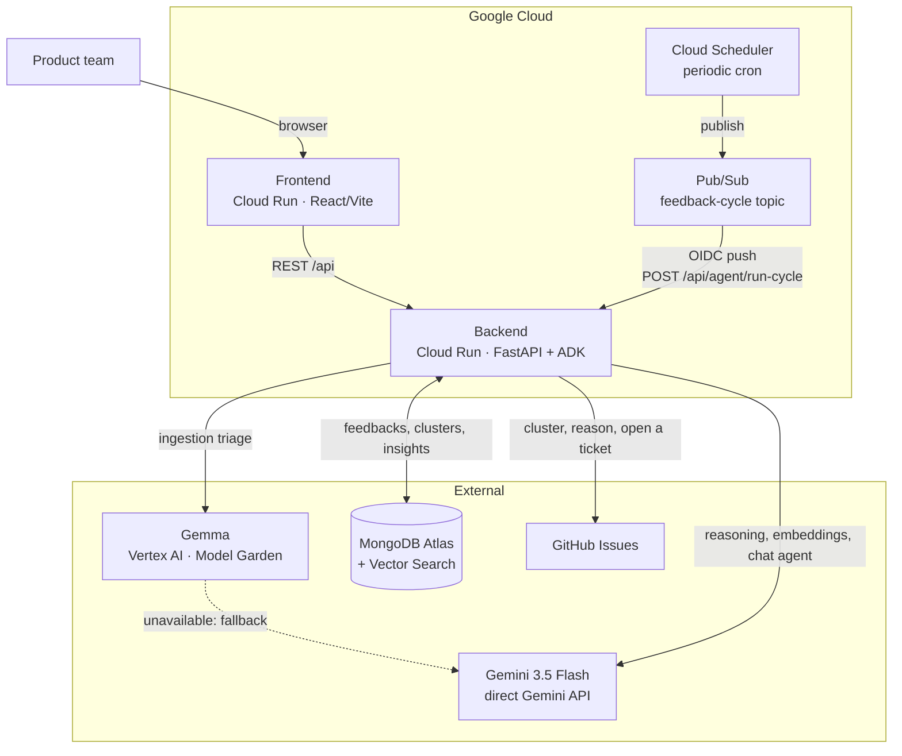

# feedbackai-agent

An agent that reads raw product feedback for early-stage SaaS teams: ingestion, triage,
clustering, insights, and action on an external tracker. Built for the *All Things Agentic*
hackathon (Devpost / Google Cloud).

**The demo projects and feedbacks (`project_id="demo"`, inserted by `setup_mongodb.py`) are
fictional**, made up to illustrate the pipeline. No real user data.

**Disclosure:** This project was built during the Submission Period in a new repository. It
reuses a small amount of pre-existing code from my earlier prototype (feedback ingestion,
clustering, and insight helpers), adapted here. Everything else, including the ADK
orchestration, the action loop, background execution, the Gemma triage stage, and the frontend,
was built during the Submission Period.

## Prerequisites

| Tool | Version | Used for |
|---|---|---|
| Python | 3.11+ | Backend (`agent/`) |
| Node.js | 20+ | Frontend (`frontend/`) |
| gcloud CLI | recent, authenticated (`gcloud auth login`) | Cloud Run / Vertex AI deployment |
| MongoDB Atlas account | active cluster | Database + Vector Search |
| GitHub token | `issues` scope only | The agent's external action (`create_ticket`) |
| Gemini API key | [aistudio.google.com](https://aistudio.google.com) | Reasoning, embeddings, triage fallback |

## Tech stack

| Layer | Technology |
|---|---|
| Agent | Google ADK (`LlmAgent` + `Runner`) |
| Reasoning, chat, summaries | `gemini-3.5-flash` (direct Gemini API, not Vertex: unavailable on Vertex for this project) |
| Embeddings | `gemini-embedding-001`, 768 dims (direct Gemini API) |
| Per-item triage (ingestion) | Gemma (Vertex AI, Model Garden), Gemini fallback |
| Backend | FastAPI |
| Data | MongoDB Atlas + Atlas Vector Search |
| Frontend | React / Vite |
| Deployment | Cloud Run (backend + frontend) |

## Architecture



Autonomous loop: `Cloud Scheduler` triggers a cycle periodically through `Pub/Sub`, which pushes
to `POST /api/agent/run-cycle` on the backend. The agent (ADK) picks up unclustered feedback,
groups it, generates insights, and **opens a real GitHub ticket** for each cluster that clears
the threshold. No human in the loop.

## Architecture: two models

- **Gemma** (Vertex AI, Model Garden): per-item triage at ingestion, language, category,
  sentiment, summary, in one call. A small dedicated model for high-volume, low-cost work.
- **Gemini 3.5 Flash** (direct Gemini API): low-volume reasoning, cluster labels,
  recommendations, the chat agent, and an **automatic fallback** for triage if the Gemma
  endpoint isn't deployed or doesn't respond.

```
text/CSV/URL feedback
       │
       ▼
  PII scrub (regex: emails, phone numbers)
       │
       ▼
  triage: Gemma ──(unavailable)──▶ Gemini 3.5 Flash (fallback)
       │
       ▼
  embedding (Gemini) → MongoDB Atlas (+ Vector Search)
       │
       ▼
  clustering, insights, chat agent (ADK) → Gemini 3.5 Flash
```

**Feedback sources:** free text, CSV upload, or a URL. A URL is handled one of two ways
(`agent/tools/fetch_url.py`):
- An App Store app page: pulls the most recent reviews through Apple's public RSS feed (no
  scraping), one feedback per review.
- Any other page: fetches it and extracts the main text, treated as a single feedback.

G2, Trustpilot, and Play Store aren't supported: their reviews load through client-side
JavaScript, invisible to a plain HTTP fetch. Scraping them properly would need a headless
browser, out of scope for now.

## MongoDB setup

1. **Create a MongoDB Atlas cluster** (the free tier is enough for the demo) and grab the
   connection URI.

2. **Create the collections, indexes, and demo data:**
   ```bash
   cd agent
   python3 setup_mongodb.py
   ```
   This script creates the 5 collections (`users`, `projects`, `feedbacks`, `clusters`,
   `insights`) with their JSON Schema validators, all application indexes, and inserts one
   project plus 8 **fictional** feedbacks (`project_id="demo"`) for the demo.

3. **Create the Atlas Vector Search index. Manual step, no way around it:** PyMongo can't
   create it (the script above prints the same instructions at the end of its run):
   - Atlas UI → your cluster → **Atlas Search** tab → **Create Search Index**
   - Pick **Vector Search** (JSON editor), Database `feedbackai`, Collection `feedbacks`
   - Paste:
     ```json
     {
       "name": "feedback_vector_index",
       "type": "vectorSearch",
       "definition": {
         "fields": [
           { "type": "vector", "path": "embedding", "numDimensions": 768, "similarity": "cosine" },
           { "type": "filter", "path": "project_id" },
           { "type": "filter", "path": "category" },
           { "type": "filter", "path": "sentiment" }
         ]
       }
     }
     ```

## Deploying to Cloud Run

Backend and frontend are two separate Cloud Run services, built through Cloud Build
(`infra/cloudbuild.backend.yaml` / `infra/cloudbuild.frontend.yaml`). The frontend needs the
backend URL **at build time** (Vite bakes it in during compilation), so deploy the backend
first.

1. **Variables** (adjust to your project):
   ```bash
   PROJECT_ID=feedbackai-497622
   ```

2. **Secrets in Secret Manager** (never in the repo):
   ```bash
   echo -n "<value>" | gcloud secrets create gemini-api-key    --data-file=- --project=$PROJECT_ID
   echo -n "<value>" | gcloud secrets create mongodb-uri       --data-file=- --project=$PROJECT_ID
   echo -n "<value>" | gcloud secrets create github-token      --data-file=- --project=$PROJECT_ID
   echo -n "<value>" | gcloud secrets create github-repo-map   --data-file=- --project=$PROJECT_ID
   echo -n "<value>" | gcloud secrets create run-cycle-secret  --data-file=- --project=$PROJECT_ID
   ```

3. **Deploy the backend:**
   ```bash
   gcloud builds submit --config=infra/cloudbuild.backend.yaml \
     --project=$PROJECT_ID .
   ```
   If the service still rejects unauthenticated calls despite `--allow-unauthenticated` (the
   Cloud Build service account may lack permission to apply the IAM policy on its own, this
   happened in practice), open it explicitly:
   ```bash
   gcloud run services add-iam-policy-binding feedback-agent \
     --region=us-central1 --member=allUsers --role=roles/run.invoker --project=$PROJECT_ID
   ```

4. **Grab the backend URL:**
   ```bash
   BACKEND_URL=$(gcloud run services describe feedback-agent \
     --region=us-central1 --format='value(status.url)' --project=$PROJECT_ID)
   ```

5. **Deploy the frontend**, passing the backend URL as a build argument:
   ```bash
   gcloud builds submit --config=infra/cloudbuild.frontend.yaml \
     --substitutions=_BACKEND_URL=$BACKEND_URL --project=$PROJECT_ID .
   ```
   Same IAM check as the backend, if needed:
   ```bash
   gcloud run services add-iam-policy-binding feedback-agent-frontend \
     --region=us-central1 --member=allUsers --role=roles/run.invoker --project=$PROJECT_ID
   ```

6. **Update the backend's `FRONTEND_ORIGINS`** with the real frontend URL (the first backend
   deploy defaults to `http://localhost:5173`, see `infra/cloudbuild.backend.yaml`):
   ```bash
   FRONTEND_URL=$(gcloud run services describe feedback-agent-frontend \
     --region=us-central1 --format='value(status.url)' --project=$PROJECT_ID)

   gcloud run services update feedback-agent --region=us-central1 \
     --update-env-vars=FRONTEND_ORIGINS=$FRONTEND_URL --project=$PROJECT_ID
   ```

**Check:** `curl $BACKEND_URL/health` responds, and the deployed frontend loads real data from
that backend (no calls to `localhost`).

## Deploying the Gemma endpoint (manual)

Claude Code doesn't touch GCP infrastructure directly. Here's the exact sequence to deploy the
Gemma endpoint once the hackathon credit is confirmed:

1. **Pick the model in Model Garden**
   GCP Console → Vertex AI → Model Garden → search "Gemma". Pick an instruction-tuned variant:
   `gemma-3-1b-it` (lowest cost) or `gemma-3-4b-it` (sturdier on FR/EN), depending on the
   triage quality you observe.

2. **Deploy to a dedicated endpoint**
   From the model page: "Deploy" → vLLM container (image provided by Model Garden). Machine
   `g2-standard-12` + 1 `NVIDIA_L4` GPU. Give the endpoint a clear name (e.g.
   `feedbackai-gemma-triage`).

3. **Grab the ENDPOINT_ID**
   ```bash
   gcloud ai endpoints list --region=<GEMMA_LOCATION> --format="table(name,displayName)"
   ```
   `ENDPOINT_ID` is the last segment of `name` (`projects/.../endpoints/<ID>`).

4. **Set the environment variables** (`.env`, never committed):
   ```
   GCP_PROJECT_ID=<your project>
   GEMMA_ENDPOINT_ID=<the ID above>
   GEMMA_LOCATION=<deployment region>
   ```

5. **Measured request/response format** ("vLLM 32K context" deployment, `gemma-3-1b-it` /
   `NVIDIA_L4`, dedicated endpoint). Already handled by `agent/gemma_client.py`, but worth
   re-checking if the deployment changes container or config:
   - **Dedicated** endpoints (`dedicatedEndpointEnabled`, on by default for one-click Model
     Garden deployments) need a direct HTTP call to their own
     `*.prediction.vertexai.goog` domain, not the Vertex SDK (gRPC isn't supported on that
     domain, and the SDK's REST transport adds query parameters the gateway rejects).
   - The instance is sent in `"@requestFormat": "chatCompletions"` form
     (`messages: [{role, content}]`), required by this type of vLLM container.
   - The response's `predictions` field is **not** a list; it's the `chat.completion` object
     directly (`predictions.choices[0].message.content`).
   - `gemma-3-1b-it` sometimes wraps its JSON in ```` ```json ... ``` ```` fences despite the
     prompt asking it not to. Stripped in `ingest_feedback.py` before parsing.

6. **Undeploy after the demo** (billed by uptime, not by request):
   ```bash
   gcloud ai endpoints undeploy-model <ENDPOINT_ID> \
     --deployed-model-id=<DEPLOYED_MODEL_ID> --region=<GEMMA_LOCATION>
   ```
   The Gemini fallback means cutting the endpoint doesn't break anything: the app keeps working
   without it.

## Scheduled trigger (Cloud Scheduler + Pub/Sub)

**Prerequisite: the backend must already be running on Cloud Run** (deployment step above), the
push subscription needs a real URL. If that's not done yet, come back to this section later.

Setup: `Cloud Scheduler` publishes to a `Pub/Sub` topic, which pushes (with an OIDC token) to
`POST /api/agent/run-cycle` on Cloud Run. The endpoint verifies that token itself (see
`agent/main.py`), never a public unauthenticated service.

1. **Variables** (adjust to your project):
   ```bash
   PROJECT_ID=feedbackai-497622
   REGION=us-central1
   SERVICE_NAME=feedback-agent
   ```

2. **A dedicated service account for Pub/Sub:**
   ```bash
   gcloud iam service-accounts create pubsub-run-cycle-invoker \
     --display-name="Pub/Sub push invoker for run-cycle" \
     --project=$PROJECT_ID
   ```

3. **Let that account call the Cloud Run service:**
   ```bash
   gcloud run services add-iam-policy-binding $SERVICE_NAME \
     --region=$REGION \
     --member="serviceAccount:pubsub-run-cycle-invoker@${PROJECT_ID}.iam.gserviceaccount.com" \
     --role="roles/run.invoker"
   ```

4. **Let the Pub/Sub service agent mint tokens on that account's behalf:**
   ```bash
   PROJECT_NUMBER=$(gcloud projects describe $PROJECT_ID --format='value(projectNumber)')
   gcloud iam service-accounts add-iam-policy-binding \
     pubsub-run-cycle-invoker@${PROJECT_ID}.iam.gserviceaccount.com \
     --member="serviceAccount:service-${PROJECT_NUMBER}@gcp-sa-pubsub.iam.gserviceaccount.com" \
     --role="roles/iam.serviceAccountTokenCreator"
   ```

5. **Create the topic:**
   ```bash
   gcloud pubsub topics create feedback-cycle --project=$PROJECT_ID
   ```

6. **Create the push subscription, with the OIDC audience:**
   ```bash
   SERVICE_URL=$(gcloud run services describe $SERVICE_NAME --region=$REGION --format='value(status.url)')

   gcloud pubsub subscriptions create feedback-cycle-push \
     --topic=feedback-cycle \
     --push-endpoint="${SERVICE_URL}/api/agent/run-cycle" \
     --push-auth-service-account="pubsub-run-cycle-invoker@${PROJECT_ID}.iam.gserviceaccount.com" \
     --push-auth-token-audience="${SERVICE_URL}/api/agent/run-cycle" \
     --project=$PROJECT_ID
   ```

7. **Set the Cloud Run service's remaining environment variables:**
   ```
   PUBSUB_PUSH_SERVICE_ACCOUNT=pubsub-run-cycle-invoker@<PROJECT_ID>.iam.gserviceaccount.com
   RUN_CYCLE_AUDIENCE=<SERVICE_URL>/api/agent/run-cycle
   ```

8. **Create the Cloud Scheduler job** (every 6h, for example):
   ```bash
   gcloud scheduler jobs create pubsub feedback-cycle-scheduler \
     --schedule="0 */6 * * *" \
     --topic=feedback-cycle \
     --message-body='{"project_id":"demo"}' \
     --location=$REGION \
     --time-zone="Europe/Paris" \
     --project=$PROJECT_ID
   ```
   `message-body` becomes the Pub/Sub message payload (base64-encoded automatically), which is
   exactly what `agent/main.py` expects to decode to find `project_id`.

**Required IAM roles (summary)**

| Identity | Role | On | Why |
|---|---|---|---|
| SA `pubsub-run-cycle-invoker` | `roles/run.invoker` | The Cloud Run service | Lets Pub/Sub (through this SA) call the endpoint |
| Pub/Sub service agent (`service-<PROJECT_NUMBER>@gcp-sa-pubsub.iam.gserviceaccount.com`) | `roles/iam.serviceAccountTokenCreator` | The SA `pubsub-run-cycle-invoker` | Lets Pub/Sub mint OIDC tokens on that SA's behalf |
| Cloud Scheduler service agent | `roles/pubsub.publisher` | The `feedback-cycle` topic | Usually granted automatically by `gcloud scheduler jobs create pubsub`, worth double-checking (`gcloud pubsub topics get-iam-policy feedback-cycle`) |

**Check:** wait for the next scheduled run (or force one with
`gcloud scheduler jobs run feedback-cycle-scheduler --location=$REGION`), then confirm in the
Cloud Run logs (`gcloud run services logs read $SERVICE_NAME --region=$REGION`) that a cycle
ran. Keep a screenshot for the GCP proof and the video.

## Running locally

```bash
cd agent
uvicorn main:app --host 0.0.0.0 --port 8000 --loop asyncio
```

**`--loop asyncio` is required, not optional.** `uvloop` (uvicorn's default loop) silently
breaks outgoing `httpx` calls to the GitHub API (`ConnectTimeout`), used by `create_ticket`.
Measured and reproduced outside the server: without this flag, `POST /api/agent/run-cycle`
fails with a 500 as soon as a ticket needs to be created.

## Environment variables

See `.env.example` for the full list. Summary:

| Variable | Used for | Required? |
|---|---|---|
| `GEMINI_API_KEY` | Chat, reasoning, embeddings, triage fallback | Yes |
| `MONGODB_URI` / `MONGODB_DB` | Database | Yes |
| `GCP_PROJECT_ID` | Resolving the Gemma endpoint | No, falls back to Gemini without it |
| `GEMMA_ENDPOINT_ID` / `GEMMA_LOCATION` | Deployed Gemma endpoint | No, same fallback |
| `GITHUB_TOKEN` / `GITHUB_REPO_MAP` | Creating GitHub tickets | Yes, for `create_ticket` |
| `RUN_CYCLE_SECRET` | Direct auth for `run-cycle` (testing/debugging) | No |
| `PUBSUB_PUSH_SERVICE_ACCOUNT` / `RUN_CYCLE_AUDIENCE` | OIDC auth for `run-cycle` from Pub/Sub | No, without them only `RUN_CYCLE_SECRET` works |
